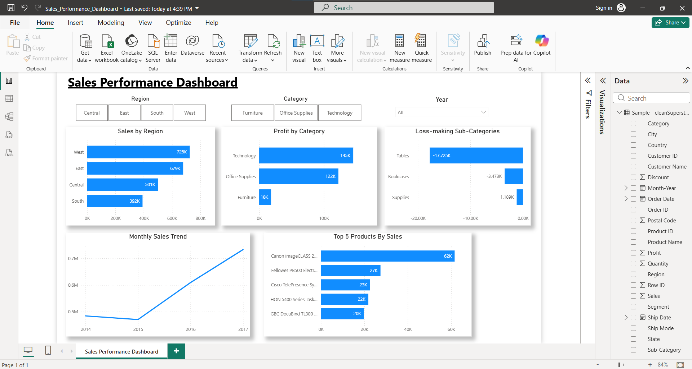

  Sales Performance Dashboard (Power BI Project)

# Overview
This project is a Power BI dashboard created to analyze sales performance, profit trends, and business insights using the Superstore dataset.

# Features
- Sales by Region
- Profit by Category
- Monthly Sales Trend
- Top Products by Sales
- Loss-making Sub-Categories
- Interactive filters (Region, Category, Year)

# Tools Used
- Power BI
- Excel

# Key Insights
- West region has the highest sales
- Technology category generates the highest profit
- Some sub-categories like Tables and Bookcases are loss-making
- Sales trend shows growth over the years

#  Dashboard Preview

# Files
- Sales_Performance_Dashboard.pbix
- SalesPerformanceDashboard.png

# Business Impact
This dashboard helps identify high-performing regions and products, detect loss-making areas, and support data-driven decision-making for improving profitability.
